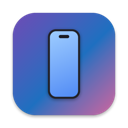
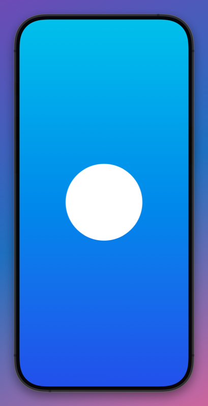

<p align="center">
  
</p>

<h1 align="center">Present</h1>

<p align="center">
Mirror your USB-connected iPhone on your Mac with QuickTime-level latency,<br>
framed in a photoreal device bezel over a pretty background —<br>
made for sharing the window in calls (Google Meet, Zoom, …).
</p>

<p align="center">
  
</p>

## Features

- **Low-latency USB mirroring** — uses the same CoreMediaIO screen-capture
  mechanism as QuickTime, rendered through `AVCaptureVideoPreviewLayer`
  (the fastest display path there is).
- **Photoreal device frames** — the exact bezel for the connected model,
  taken from Xcode Simulator's vector chrome artwork, including animated
  side buttons (click them!). Falls back to a drawn bezel when no simulators
  are installed.
- **Automatic model detection** — the connected iPhone's hardware identifier
  (e.g. `iPhone18,2`) picks the right frame; manual override available.
- **Backgrounds** — gradient presets or your own image.
- **Screenshots & recordings** — composed at the stream's native resolution
  (background + frame + video), not a window grab. PNG to `~/Pictures` (⌘S),
  H.264 `.mov` to `~/Movies` (⌘R).
- **Clean window for sharing** — hidden title bar; controls only appear when
  the mouse reaches the bottom edge, Dock-style. Portrait and landscape both
  supported.

## Requirements

- macOS 14 (Sonoma) or later, Apple Silicon or Intel
- Xcode command line tools to build (`xcode-select --install`)
- Optional: Xcode with iOS simulators installed, for the photoreal frames
  (`/Library/Developer/DeviceKit`); without them a drawn bezel is used
- An iPhone + USB cable

## Build & launch

```sh
git clone https://github.com/oozou/present.git
cd present
./build.sh
open build/Present.app
```

On first launch:

1. **Allow camera access** when prompted — that's how macOS gates iPhone
   screen capture (nothing is recorded unless you ask).
2. Connect your iPhone via USB-C, **unlock it**, and tap **Trust** if asked.
3. The stream appears automatically, and survives unplug/replug.

Then share the Present window in your call.

> The app is ad-hoc signed, so macOS treats every rebuild as a new app and
> asks for camera access again after `./build.sh`. Normal launches don't ask.

## Usage

Move the mouse to the bottom edge of the window to reveal the control bar:

| Control | What it does |
| --- | --- |
| Status light | Connected device and detected model |
| iPhone button | Toggle the device frame on/off |
| Sliders menu | Frame style (photoreal/stylized), device model override, phone size |
| Camera button (⌘S) | Save a composed screenshot to `~/Pictures` |
| Record button (⌘R) | Record a composed H.264 movie to `~/Movies` |
| Color dots | Background gradient presets |
| Photo button | Pick a background image |

Drag anywhere on the background to move the window. Click the phone's side
buttons to see them depress (cosmetic only — the mirror stream is one-way).

## How it works

- Setting the CoreMediaIO `kCMIOHardwarePropertyAllowScreenCaptureDevices`
  property makes iOS devices appear as `AVCaptureDevice`s — the same
  mechanism QuickTime's movie recording uses.
- iPhone screen devices report their `activeFormat` as 0×0; the real stream
  dimensions (and rotation changes) arrive via
  `AVCaptureInputPortFormatDescriptionDidChange`.
- The mirrored device only reports `modelID: "iOS Device"`, but its sibling
  Continuity Camera device exposes the true hardware identifier, which maps
  to Simulator chrome via `/Library/Developer/DeviceKit/chrome_map.plist`.
- Frames, screen masks, and side buttons are Apple's own vector PDFs from
  `*.devicechrome` bundles; the screen position is derived from the artwork
  geometry, so no per-model tables are needed.
- Exports composite the scene on the GPU (CoreImage) from a parallel
  `AVCaptureVideoDataOutput` tap, so recording doesn't touch preview latency.

## Development

```sh
swift build          # debug build
./build.sh           # release build + app bundle (build/Present.app)
```

Logs go to `~/Library/Logs/Present.log`.
